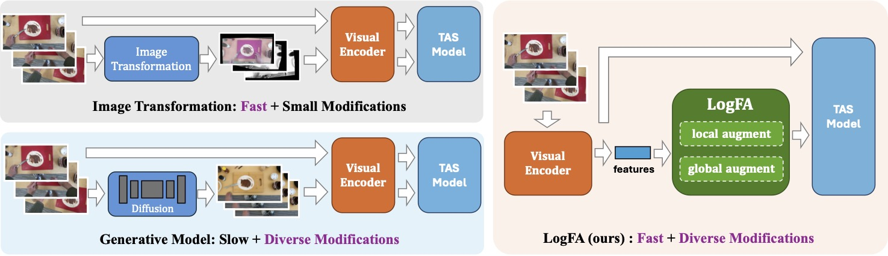

<!-- # LogFA -->
<h2 align="center"> <a href="">LogFA: Feature-Space Data Augmentation in Long Egocentric Videos Using Foundation Models</a></h2>

We propose **LogFA** (**Lo**cal-**g**lobal **F**eature-space **A**ugmentation), a novel framework that performs *controlled data augmentation directly in the feature space*. LogFA includes a local augmentation module with *Prompt-based Feature Enhancement* and a global augmentation with *Generalized Directed Acyclic Graph*. LogFA is capable of creating diverse video features with a low computation cost. 



## Preparation

### 1. Install

```bash
conda env create -f src/environment.yaml
conda activate logfa
```

### 2. Prepare code

Name the checkout directory `src/` and run every `python -m src.*` command from
its parent directory:

```bash
cd /path/to/parent-of-src
```

### 3. Prepare data

The data packages are distributed separately on Google Drive:

**https://drive.google.com/drive/folders/1TunJuwp93bkb4EkTU2VMeA1EDGzsvRzF**

| Archive | Size | Contents |
| --- | --- | --- |
| `LogFA-EgoPER-v1.zip` | 8.0 GB | EgoPER annotations, captions, base + local-PFE features, GDAG graphs, and the 20 LogFA checkpoints |
| `LogFA-EgoProceL-v1.zip` | 86 MB | EgoProceL annotations, splits, captions, and base features |

Extract a package under `src/data/` (or point `--data-root` / `LOGFA_DATA_ROOT`
at it anywhere), and optionally verify against the shipped `SHA256SUMS`:

```bash
cd src/data
unzip LogFA-EgoPER-v1.zip
sha256sum -c SHA256SUMS      # checks any archives present in this directory
```

```text
e39915fdf5e87736d35e582079203781a44cd91e7c5a295d72c5ddf4f4d34ad1  LogFA-EgoPER-v1.zip
f3677c8fe3ccb4a9cbe9eb9b8f4a0599a4ec2402a774537c16a2c7499f0810a0  LogFA-EgoProceL-v1.zip
```

See [data/README.md](data/README.md) for the package layout and feature formats.

## Training

Run one recipe for a chosen mode (`local_aug`, `global_aug`, or `logfa`):

```bash
python -m src.train \
  --mode logfa \
  --recipe coffee \
  --device cuda \
  --data-root src/data/LogFA-EgoPER-v1
```

Repeat for the other EgoPER recipes (`oatmeal`, `pinwheels`, `quesadilla`,
`tea`). For EgoProceL, pass `--dataset egoprocel` and an EgoProceL recipe
(`ETENT`, `PC_assemble`, `PC_disassemble`, `MECANNO`).

The default configuration uses the canonical 3-video training split, block
layout `iuu`, and 2,000 iterations. Training-time behavior:

- Local Aug interpolates base SigLIP features with local PFE.
- Global Aug samples a GDAG order and rearranges observed action segments.
- LogFA applies the Local Aug operation, then the Global Aug operation.

Resolve a configuration without loading data or training, and override any value
after `--set`:

```bash
python -m src.train --mode logfa --recipe coffee --dry-run
python -m src.train --mode local_aug --recipe tea \
  --device cuda --data-root src/data/LogFA-EgoPER-v1 --set aux.runid 1
```

## Evaluation

Evaluate a trained checkpoint directly:

```bash
python -m src.evaluate \
  --checkpoint DATA_ROOT/weights/fact/logfa/coffee/seed0/model.pth \
  --config DATA_ROOT/weights/fact/logfa/coffee/seed0/config.yaml \
  --device cuda \
  --data-root DATA_ROOT
```

For OOD / error-video evaluation, pass its split and enable error labels:

```bash
python -m src.evaluate \
  --checkpoint DATA_ROOT/weights/fact/logfa/coffee/seed0/model.pth \
  --config DATA_ROOT/weights/fact/logfa/coffee/seed0/config.yaml \
  --device cuda --data-root DATA_ROOT \
  --test-split all_errors --error-video
```

`evaluate.py` prints the metrics and, with `--output`, writes them to a file.

Verify a fresh setup without a GPU:

```bash
python -m src.train --mode logfa --recipe coffee --device cpu --dry-run
python3 -m py_compile src/train.py src/evaluate.py src/models/*.py src/utils/*.py
```

## Datasets

Both datasets ship as self-contained packages and use the same GDAG task-graph
format (`{nodes, edges}` with repetition range `c1..c2`, sampled by
`GDAGPlanner`):

- `egoper` (default) — recipes: coffee, oatmeal, pinwheels, quesadilla, tea.
  Ships the data, the local PFE sweep, and the 20 LogFA checkpoints
  (5 recipes x 4 seeds).
- `egoprocel` — recipes: ETENT, PC_assemble, PC_disassemble, MECANNO
  (split `split1`). Ships annotations, splits, captions, and base features;
  generate the GDAG task graphs, local PFE sweep, and weights with the steps
  below.

### Regenerate the local PFE sweep

Local Aug and LogFA read
`features/local_pfe_sweep/{recipe}/{video}_{tprompt_idx}.npy` (18 prompt-learning
configs per video). The EgoPER package ships these arrays; you can also rebuild
them from the shipped captions:

- `captions/{video}_rewritten.jsonl` — captions plus `rewrite.Method1..Method4`,
  the input to PFE generation.
- `augmentation/local_aug/generate_pfe.py` — prompt-learns each caption set
  against the base SigLIP feature (needs the SigLIP2 model and a GPU).

The 18 configs are the grid
`tprompt_idx = nprompt{3,4} x loss_weight_total{0.7,0.5,0.3} x naug{2,4,1}`.
Generate one config at a time:

```bash
python -m src.augmentation.local_aug.generate_pfe \
  --data-root DATA_ROOT --recipe coffee \
  --captions-dir DATA_ROOT/captions \
  --tprompt-idx 4 --naug 4 --prompt-length 3 --loss-weight-total 0.3 \
  --rewrite-cap 4 --seed 0
# writes DATA_ROOT/features/local_pfe_sweep/coffee/{video}_4.npy
```

### EgoProceL, step by step

The package ships the data (annotations / captions / features). Produce the
GDAG, PFE, and weights:

1. **Generate the GDAG task graphs** (needs an LLM endpoint):

   ```bash
   python -m src.augmentation.global_aug.generate_egoprocel_gdag \
     --data-root src/data/LogFA-EgoProceL-v1 \
     --base-url http://localhost:8000/v1 --api-key EMPTY
   ```

   Writes `gdag/{recipe}.json` in the `{nodes, edges}` format for `GDAGPlanner`.

2. **Generate the local PFE** per recipe (needs the SigLIP2 model and a GPU):

   ```bash
   python -m src.augmentation.local_aug.generate_pfe \
     --data-root src/data/LogFA-EgoProceL-v1 --recipe MECANNO \
     --captions-dir src/data/LogFA-EgoProceL-v1/captions \
     --tprompt-idx 0 --naug 4 --prompt-length 3 --loss-weight-total 0.3
   ```

   A single `--tprompt-idx 0` is enough for LogFA (`cfg.tprompt_idx` defaults to
   0); repeat over the grid for the full sweep.

3. **Train and evaluate** with `--dataset egoprocel`:

   ```bash
   python -m src.train --dataset egoprocel --mode logfa --recipe MECANNO \
     --device cuda --data-root src/data/LogFA-EgoProceL-v1
   python -m src.evaluate \
     --checkpoint .../model.pth --config .../config.yaml \
     --device cuda --data-root src/data/LogFA-EgoProceL-v1
   ```

The augmentation settings for each recipe are in `configs/egoprocel/*.yaml`.

## Offline augmentation

`src/augmentation/` holds the artifact-generation code; training imports only the
prepared artifacts, never these modules:

- `local_aug/`: caption, rewrite, and PFE generation.
- `global_aug/`: GDAG generation and graph preparation.
- `image_transform/` and `generative/`: features for ablations.

## Citation
```text
@inproceedings{
    lu2026logfa,
    title={{LogFA}: Feature-Space Data Augmentation in Long Egocentric Videos Using Foundation Models},
    author={Zijia Lu and Ehsan Elhamifar},
    booktitle={European Conference on Computer Vision},
    year={2026},
}
```